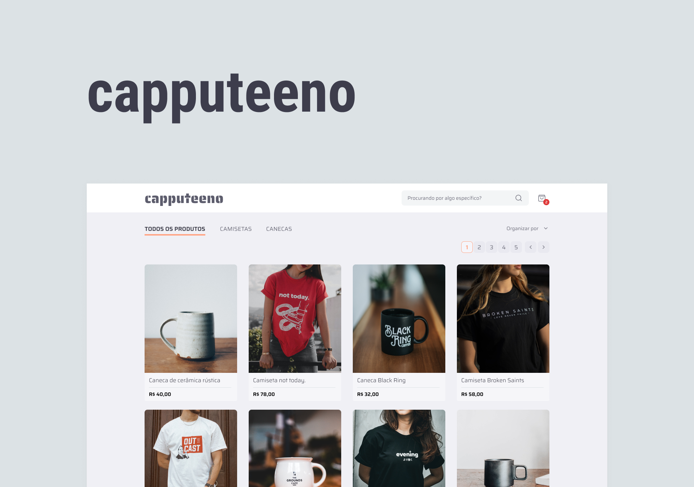

# Capputeeno

A loja de canecas e camisas da Rocketseat, tome um cafézinho vestido elegantemente.



## Rodando localmente

Clone o projeto

```bash
  git clone https://github.com/code-pisces/capputeeno
```

Entre no diretório do projeto

```bash
  cd capputeeno
```

Instale as dependências

```bash
  npm install
```

Inicie o servidor

```bash
  npm run dev
```

## Variáveis de Ambiente

Para rodar esse projeto, você vai precisar adicionar as seguintes variáveis de ambiente no seu .env, tem um exemplo no arquivo `env.example`.

`API_BASE_URL`

## Rodando os testes

Para rodar os testes unitários, rode o seguinte comando:

```bash
  npm run test:unit
```

Para rodar os testes e2e, rode o seguinte comando:

```bash
  npm run test:e2e
```

## Stack utilizada

**Front-end:** React, Next.js, Typescript, Apollo Client, Styled Components & Radix UI.

**Back-end:** JSON Server GraphQL.

## Autores

- [@code-pisces](https://www.github.com/code-pisces)
